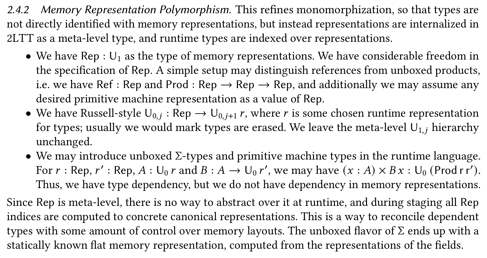

<style>
section {
  font-family: "Roboto Mono";
}
code {
  font-family: "Roboto Mono";
  line-height: 1.5 !important;
}
pre {
  background-color: var(--color-canvas-default) !important;
  border: 0;
  font-size: 1.0em !important;
}
.ref {
  color : grey;
}
</style>

# Unboxed Data with Dependent Types

Constantine Theocharis and Ellis Kesterton

_University of St Andrews_

TYPES 2025

---
<!-- ---

# What is left to make dependent type systems usable for building real-world software?

Potentially many things

* Better error messages
* Higher community awareness
* Faster typechecking
* ...
* More control over code generation

--- -->

# Programming with unboxed data

* unboxed data = no forced heap indirections

* The 'standard' in languages like C/C++, Rust, etc.

* Why?
  * Contiguous arrays with constant-time indexing.
  * Unboxed integers and packing small data.
  * Protocol buffers (e.g. network packets)
  * Data-driven design (e.g. entity-component systems)
  

---

# What's the problem?

* With dependent types, we cannot resolve the _size in bytes_ each type takes up, at compile time.

  ```hs
    foo : (b : Bool) -> if b then Int else (Int, Int)
    foo True = 1
    foo False = (1, 1)
  ```

* Dependently typed (and most functional) languages will box pretty much everything.

<!-- ---

# Existing approaches

- DSLs for byte buffers and other low-level data <span class="ref">[Allais 2023]</span>.
  - <mark>Encoding overhead, unsafe code/postulates, does not avoid boxing.</mark>
- Imperative separation logic based systems <span class="ref">[Dafny]</span>.
  - <mark>Complicated theory, no full dependent types.</mark>
- Views of inductive families as primitive data <span class="ref">[McBride+McKinna 2004, Allais 2023, Theocharis+Brady 2025]</span>.
  - <mark>Unsafe code/postulates, does not avoid boxing.</mark>

--- -->

---

# But what if we could?

* Staged Compilation with 2LTT <span class="ref">[Kovács 2022]</span>

  


---

# Goals

* A language where stack-allocated unboxed data is the default
* Explicit boxing primitive
* Efficient and safe indexing into data
* Zero-sized types = computational irrelevance
* Minimal other primitives: arrays are iterated sigma types
* 2LTT-compatible for metaprogramming

---

# Non-goals

* Manual memory management/no GC
* Holding references to stack values
* Lifetime analysis, uniqueness or linearity
* Unboxed closures

---

# Setup & notation

* Two-level type theory `(Ty, Ty1, Tm, Tm1)`, SOAS.
* I will define and focus on the object fragment.
* The meta fragment is standard dependent type theory.

  ```hs
  Set           -- Universe of small types in the metatheory
  TYPE : TYPE   -- Universe (type-in-type) in the meta level

  (x : A) -> B  -- Π at any level
  (x : A, B)    -- Σ at any level
  ```


---

# What would this type system look like?


Layouts describe arrangements of data in memory.

```hs
  Layout : TYPE
  0, 1, ptr, idx : Layout
  _+_ : Layout -> Layout -> Layout
```
  
```hs
  ptr + idx + idx + 1 : Layout
  -- A pointer followed by two integers, followed by a byte
```
  <!-- _*_ : Tm₁ Nat -> Tm₁ Layout -> Tm₁ Layoyut -->
  
---

* Object-level types are indexed by their layout.

  ```hs
  Ty : Tm1 Layout -> Set
  Tm : Ty l -> Set
  ```

* Grothendiek-style universe

  ```hs
  Type : Tm1 Layout -> Ty 0
  Tm (Type l) = Ty l
  ```

* Effectively:
  ```hs
  Type l : Type 0
  ```

---

The standard type formers are now indexed by an appropriate layout:

* Functions are pointer-sized, and box their captures.

  ```hs
  A : Ty a
  B : Tm A -> Ty b
  —————————————————————————
  (x : A) '->' B x : Ty ptr
  ```
  
  
---

* Pairs store their data contiguously

  ```hs
  A : Ty a
  B : Tm A -> Ty b
  —————————————————————————
  (x : A, B x) : Ty (a + b)
  ```


* The unit type exists for all layouts, and acts like padding

  ```hs
  —————————
  () : Ty u
  ```

---

# Example: ADTs as tagged unions

```hs
  Bool : Type 1

  Maybe : Type b -> Type (1 + b)
  Maybe T = (full : Bool, if full then T else ())
--           — 1 byte ——  ——————— b bytes ——————

  Just : T -> Maybe T
  Just x = (true, x)
            
  Nothing : Maybe T
  Nothing = (false, ())
```

---

# Explicit boxing

* A box introduces a heap indirection, always pointer-sized.

  ```hs
  A : Type a       
  ————————————————
  Box A : Type ptr
  ```

* We can go back and forth using `box` and `unbox` operators.
  ```hs
   (box, unbox) : Box A ≃ A
  ```
  
---
  
  ```hs
   Byte : Type 1

   (1, 2, ..., 100) : (Byte, Byte, ..., Byte) : Type 100

   box (1, 2, ..., 100) : Box (Byte, Byte, ..., Byte) : Type ptr
  ```

---

# Runtime-sized data

* A lot of the time we actually work with data whose size is only known at runtime! Prototypical example: **dynamic arrays**
* Let's extend the layouts:

  ```hs
   Layout? : TYPE
   _*_ : Nat -> Layout? -> Layout?
   ...
   sta : Layout -> Layout?
  ```

* Here `Nat` is partially static, and `_*_/_+_` have appropriate reduction rules.

---

* Now let's expand the universe of types:

  ```hs
   Type? : Tm1 Layout? -> Ty 0
   Type l = Type? (sta l)
  ```

* Types of terms must still always be of a known layout

  ```hs
   Ty : Tm1 Layout -> Set
  ```

---

# Generating runtime-sized data

* We introduce a new type former that represents the 'generation' of runtime-sized data

  ```hs
   Make : Type? l -> Type ptr
   (emb, give) : {A : Type a} -> Make A ≃ A
  ```

* A `Make A` is thought of as `*mut A -> ()`: construct an `A` at some given location.


---

# How do we construct runtime-sized data?

* Pairs and units generalise to the runtime-sized setting.

  ```hs
   () : Make ()
   (_,_) : (x : Make A) -> Make (B x) -> Make (x : A, B x)
  ```
  
* Can generalise boxing to runtime-sized data.

<!-- ---

* We can now generalise boxing to unsized data:

  ```hs
   Box : Type? l -> Type ptr
   box : Make A -> Box A
  ```

<!-- - Boxing takes any 'recipe' ` r  = (n, f)` to make `A` and effectively runs `x <- malloc(n); f(x)`. -->

<!-- * We can recover the old `box`, in the case where `A : Type l`. --> -->

---

# Example: Arrays

* Can be defined as iterated pairs

  ```hs
   Array : Type t -> (n : Nat) -> Type (n * t)
   Array T 0 = () -- Type (0 * l) = Type 0
   Array T (S n) = (t : T, Array T n)
                  -- Type (S n * t) = Type (t + n * t)

   replicate : T -> (n : Nat) -> Make (Array T n)
   replicate t 0 = ()
   replicate t (S n) = (give t, replicate t n)
  ```

---

* To actually store arrays we must somehow box their contents

  ```hs
   Vect : Type t -> Nat -> Type ptr
   Vect T n = Box (Array T n)

   List : Type t -> Type ptr
   List T = (n : Nat0, Vect T (dyn n))
  ```

* Or work with them directly on the stack if their size is 
known at compile-time.

  ```hs
  (0x1, 0x2, 0x3) : Array 3 Word : Type (word + word + word)
  ```

---

# Computational irrelevance

* Possible with the existence of zero-sized types.

  ```hs
   0_ : Type a -> Type 0
   irr : A -> 0 A
   already : 0 0 A -> 0 A
  ```

---

* Irrelevant terms can be eliminated into zero-sized types.

  ```hs
   P : 0 A -> Type 0
   p : (x : A) -> P (irr x)
   a : 0 A
   ————————————————————————————
   let (irr x) = a in p x : P a
  ```

* With elaboration/sugar, similar to QTT with {0, ω}.

  ```hs
   at : {n : 0 Nat} -> Fin n -> Vect T n -> T
  ```

---

# Indexing

* Iterated projections of data occupy intermediate stack space.

* Instead we can build up and store indices that are 'instantly' able to access their target.

  ```hs
    A : Type? a
    B : 0 A -> Type? b
    ——————————————————————————
    (x : A) >> B x : Type idx
  ```

* `(x : A) >> B x` is an index into some `x : A` producing a `B x`. It is compiled as an integer offset.

---

* When `A` is sized, we get an application operation

  ```hs
   _[_] : (a : A) -> ((x : A) >> B x) -> Make (B a)
  ```

* However, we do not have lambda abstractions. Instead, we have a 'section' composition operation

  ```hs
   f : (x : A) >> B x
   g : (x : 0 A) -> (y : B x) >> C y
   —————————————————————————————————
   f . g : (x : A) >> C x[f]
  ```

---

* The dependent pair projections come in this form

  ```hs
   fst : (x : A, B x) >> A
   snd : (p : (x : A, B x)) >> B p[fst]
  ```

* We can thus compute array indices

  ```hs
   at : Fin n -> Array T n >> T
   at FZ = fst
   at (FS i) = snd . get i

---

  ```hs
   tape : Array 100 Symbol
   ———————————————————————
   tape[at 54] : Symbol


   players : Game >> List Player
   game : Game
   —————————————————————————————
   game[players . at 3] : Player
  ```

---

# Overview

```hs
-- generating runtime-sized terms
Make : Type? a -> Type ptr

-- heap allocation
Box : Type? a -> Type ptr

-- irrelevant data 
0_ : Type? a -> Type 0

-- indexing into data
_>>_ : (A : Type? a) -> (0 A -> Type? b) -> Type idx
```

---

# Staging and compilation

* `Layout` gets translated to a fully static representation, can be computed to a byte size at compile time.
* `Layout?` still contains object-level terms, can be computed to a byte size at runtime.

---

# Memory management

* Reference counting can be implemented because we know where the pointers are.
* Alternatively, one could use a plug-and-play garbage collection such as Bohm GC.

---

# Mutation

* Can be handled using an `ST`-like monad as usual.
* A better solution might involve sub-structural features such as linearity or uniqueness.

---

# Current progress

* Shallow embedding in Agda ✓
* Untyped model that justifies irrelevance ✓
* Implementation of this system ⚠ WIP
  - [github.com/kontheocharis/unboxed-idr]()
* Semantics ? ? ?

---

# Future work

* Finish the implementation, write some examples.
* Unboxed closures are possible through a **closed** modality.
* Investigate dependently-sized data.
* Investigate sub-structural object theories.
* Inductive types can be added, as *views* of unboxed data.

---

---

# Dependently-sized data

* Our layouts are still not able to capture the idea of dependently-sized data.

* For example, a **UDP packet** header contains a length field, which determines the amount of bytes that follow the header.

* We cannot have
  ```hs
  UdpPacket : Type? l
  ```
  because `l` must be determined by `UdpPacket`'s *inhabitants*.


---

# The solution

* Add more layouts!

  ```hs
   Layout?? : TYPE
   -- Layout < Layout? < Layout??
   var : (A : Type a) -> (A -> Layout??) -> Layout??
   Var : (A : Type a)
         -> {b : A -> Layout??}
         -> (B : (h : 0 A) -> Type?? (b a))
         -> Type?? (var A b)
   makeVar : (a : Make A) -> (b : Make (B a)) -> Make (Var A B)
  ```

* Appropriate generalisations of existing type formers.

---


# UDP packets

```hs
  UdpHeader : Type 8
  UdpHeader = (
      src : NetU16,  -- NetU16 : Type 2
      dest : NetU16,
      length: NetU16,
      checksum: NetU16
    )

  UdpPacket : Type?? (var (h : UdpHeader) | 1 * toNat h.length)
  UdpPacket = Var (h : UdpHeader) | Array Byte (toNat h.length)
```